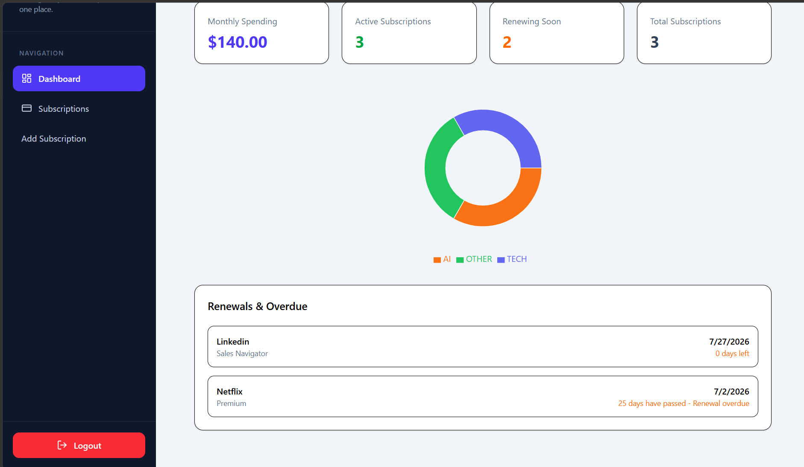
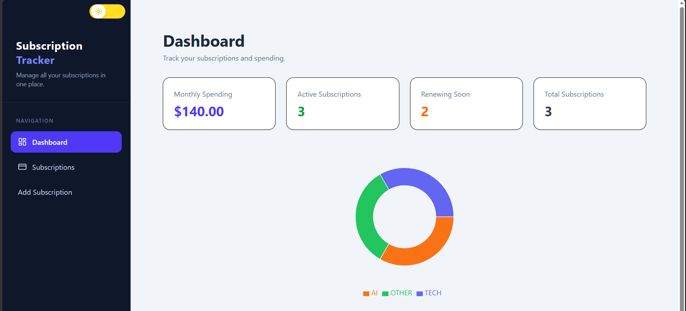
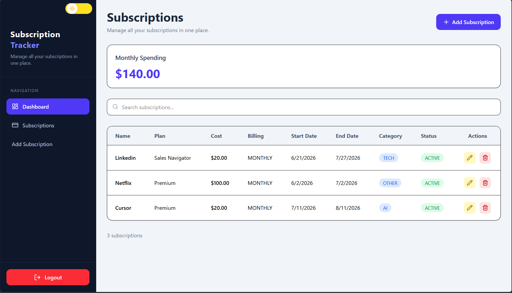
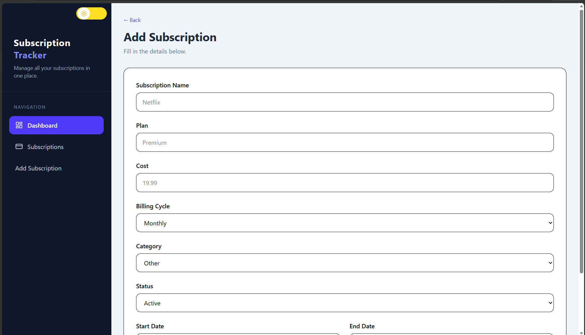

# SubTrack

SubTrack is a full-stack subscription management application that helps users organize and monitor their recurring subscriptions in one place. It provides a secure dashboard to manage subscriptions, track billing cycles, and view upcoming renewal dates.

## Features

- 🔐 Secure authentication with JWT and HTTP-only cookies
- 📋 Create, update, and delete subscriptions
- 📊 View all subscriptions in a clean dashboard
- 📅 Track subscription start and renewal dates
- 💳 Manage different billing cycles (Monthly, Yearly, Weekly)
- 🏷️ Organize subscriptions by category
- 📱 Responsive user interface
- 🔒 Protected routes and authenticated API access

## Tech Stack

### Frontend
- Next.js
- React
- Tailwind CSS
- Axios

### Backend
- Node.js
- Express.js
- Prisma ORM
- PostgreSQL
- JWT Authentication
- bcrypt

## Project Structure

```
SubTrack/
│
├── client/              # Next.js frontend
│   ├── app/
│   ├── components/
│   ├── lib/
│   └── ...
│
├── server/              # Express backend
│   ├── controllers/
│   ├── middleware/
│   ├── prisma/
│   ├── routes/
│   ├── services/
│   ├── utils/
│   └── ...
│
└── README.md
```

## Authentication

SubTrack uses JWT-based authentication.

- Passwords are securely hashed using bcrypt.
- JWT tokens are stored in HTTP-only cookies.
- Protected routes require a valid authenticated session.
- Middleware verifies the token before granting access.

## Database

The application uses PostgreSQL with Prisma ORM.

### User

- ID
- Username
- Email
- Password

### Subscription

- Name
- Plan
- Cost
- Billing Cycle
- Category
- Status
- Start Date
- End Date
- Created At
- Updated At

## API Endpoints

### Authentication

| Method | Endpoint | Description |
|---------|----------|-------------|
| POST | `/auth/login` | Login user |
| POST | `/auth/logout` | Logout user |

### Subscriptions

| Method | Endpoint | Description |
|---------|----------|-------------|
| GET | `/subscriptions` | Get all subscriptions |
| POST | `/subscriptions` | Create subscription |
| PUT | `/subscriptions/:id` | Update subscription |
| DELETE | `/subscriptions/:id` | Delete subscription |

## Installation

### 1. Clone the repository

```bash
git clone https://github.com/AyeshaSarwarr/SubTrack-Subscription-Management-System.git
cd subtrack
```

### 2. Install dependencies

Frontend

```bash
cd client
npm install
```

Backend

```bash
cd server
npm install
```

### 3. Configure environment variables

Create a `.env` file inside the server directory.

```env
DATABASE_URL=your_postgresql_database_url

JWT_SECRET=your_secret_key

PORT=5000
```

### 4. Run Prisma

```bash
npx prisma migrate dev
npx prisma generate
```

### 5. Start the backend

```bash
npm run dev
```

### 6. Start the frontend

```bash
npm run dev
```

## Future Improvements

- Email reminders before subscription renewal
- Dashboard analytics
- Search and filtering
- Subscription renewal notifications
- Expense charts and reports
- Export subscriptions to CSV/PDF
- Dark mode improvements

## Screenshots

### Login Page


### Dashboard




### All Subscriptions



### Add and Update Subscription



## Contributing

Contributions are welcome. Feel free to fork the repository, create a new branch, and submit a pull request.

## License

This project is licensed under the MIT License.